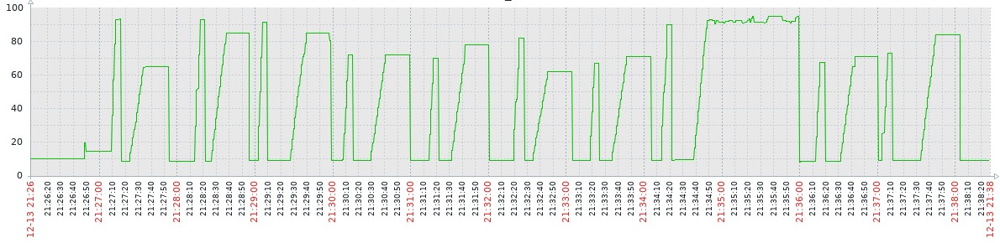

# 错误生成器

本项目意在通过控制系统各个健康指标来描述不同的系统状态。

最初的目的是，为使用机器学习方法来进行系统内存故障检测、智能运维提供具有指导性的训练数据。

项目仍在开发中，目前实现的控制粒度比较大，已完成的功能有

## 内存占用模拟

- 无动作
- 低水平占用：维持内存占用在20%左右
- 高水平占用：维持内存占用在90%左右
- 逐步上升并保持：逐步占用内存到阀值然后保持一段时间
- 逐步上升并保持然后逐步下降：逐步占用内存到阀值然后保持一段时间，最后逐步释放以占用内存
- 突发型占用：短时间内占用内存到阀值然后突然下降
- 按频率突发型占用：在一段时间内按指定频次突发型占用内存

效果示意图：

## 磁盘模拟

该模拟并不是磁盘异常或者磁盘大量I/O的模拟，而是模拟由于内存增长导致swap区在磁盘和内存之间频繁的换入换出。
